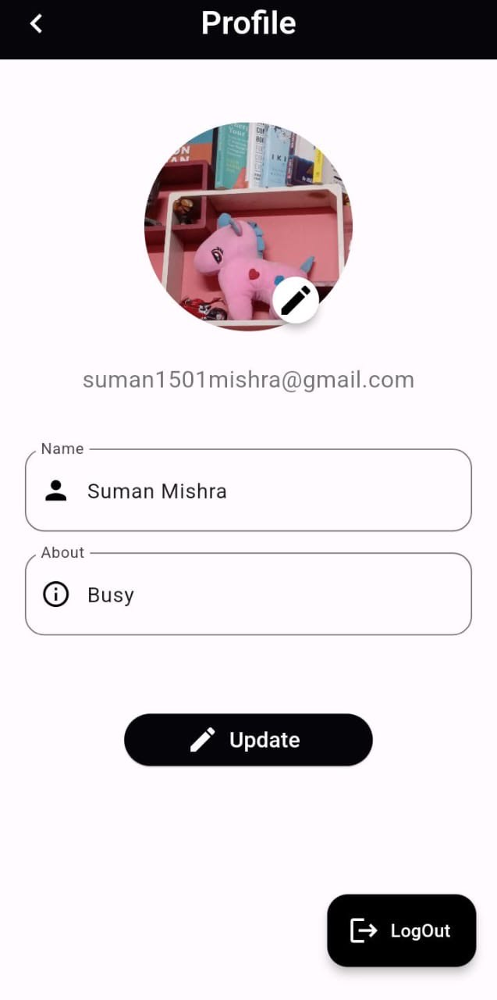

📱 Family Chat App
A real-time Flutter-based Family Chat App built using Firebase for authentication, cloud storage, messaging, and notifications.
This is a beginner-friendly Flutter project designed for learning and practice.

🚀 Features
📱 Google Sign-In Authentication

💬 Real-time messaging using Cloud Firestore

🖼️ Send and view images (Image Picker + Firebase Storage)

📥 Download shared images to gallery

🔥 Push notifications (Firebase Messaging)

😄 Emoji Picker Integration

📶 Full offline support (Firebase caching)

📸 Profile image upload and caching

🖌️ Clean and modern UI

🛠️ Built With
Flutter

Dart

Firebase Auth

Cloud Firestore

Firebase Storage

Firebase Messaging

Google Sign-In

Cached Network Image

Emoji Picker Flutter

HTTP

Flutter Notification Channel

Gallery Saver

📦 Project Structure
bash
Copy
Edit
/assets/images/         # App images/icons
/lib/                   # Flutter main source code
  /screens/             # All UI screens
  /widgets/             # Reusable components
  /services/            # Firebase and Notification services
  main.dart             # App entry point
🛠️ Setup Instructions
Clone the repository:

bash
Copy
Edit
git clone https://github.com/VivekMishra21/familyChatApp.git
Install dependencies:

bash
Copy
Edit
flutter pub get
Set up Firebase:

Create a new Firebase project.

Add your google-services.json (Android) and GoogleService-Info.plist (iOS).

Enable Authentication (Google Sign-In).

Create Firestore Database (start in test mode).

Run the app:

bash
Copy
Edit
flutter run
📸 Preview

Login Screen	Chat Screen	Profile Screen
🙏 Acknowledgements
Flutter Documentation

Firebase Documentation

📜 License
This project is licensed under the MIT License.

Happy Coding! 🚀✨
